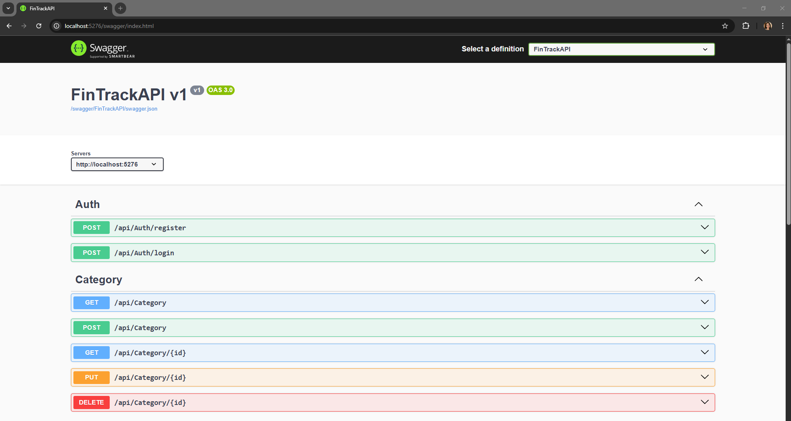
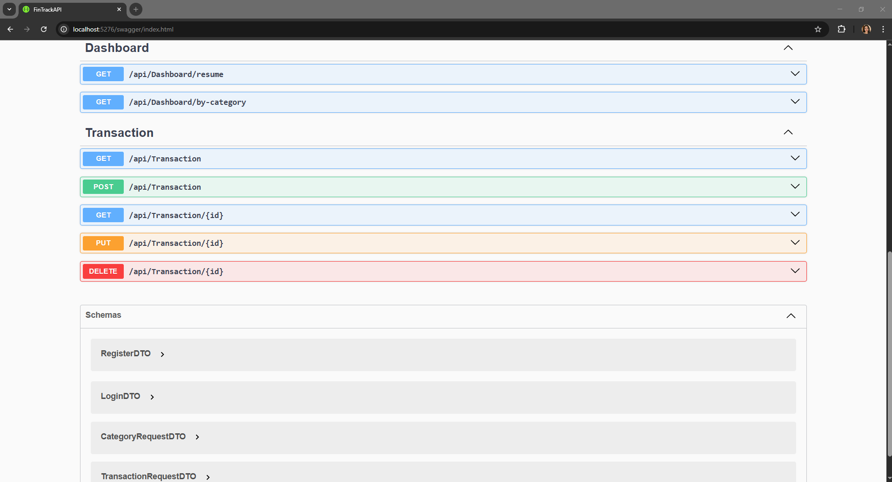

# FinTrack API

REST API for personal finance management built with .NET 10 and PostgreSQL.

## 🚀 Tech Stack

- .NET 10
- Entity Framework Core
- PostgreSQL (Supabase)
- JWT Authentication
- BCrypt password hashing
- NSwag (Swagger UI)

## 📋 Features

- User authentication with JWT
- Income and expense management
- Custom categories
- Monthly dashboard summary
- Expenses breakdown by category

## 🏗️ Architecture
```
Controller → Service → Repository → Database
```

- **Controllers** — HTTP endpoints
- **Services** — Business logic
- **Repositories** — Database access
- **DTOs** — Data transfer objects
- **Models** — Entity Framework entities

## ⚙️ Setup

1. Clone the repository

2. Create `appsettings.Development.json` based on `appsettings.json`:
```json
{
  "ConnectionStrings": {
    "DefaultConnection": "Host=your-host;Database=postgres;Username=postgres;Password=your-password;Port=5432"
  },
  "Jwt": {
    "Key": "your-secret-key-min-32-characters",
    "Issuer": "FinTrackAPI",
    "Audience": "FinTrackApp"
  }
  ...
}
```

3. Run migrations:
```bash
dotnet ef database update
```

4. Run the API:
```bash
dotnet run
```

5. Access Swagger UI at:
```
http://localhost:5276/swagger
```

## 📡 Endpoints

### Auth
| Method | Endpoint | Description |
|--------|----------|-------------|
| POST | /api/auth/register | Register new user |
| POST | /api/auth/login | Login and get JWT token |

### Categories
| Method | Endpoint | Description |
|--------|----------|-------------|
| GET | /api/category | Get all categories |
| POST | /api/category | Create category |
| PUT | /api/category/{id} | Update category |
| DELETE | /api/category/{id} | Delete category |

### Transactions
| Method | Endpoint | Description |
|--------|----------|-------------|
| GET | /api/transaction | Get transactions by month |
| POST | /api/transaction | Create transaction |
| PUT | /api/transaction/{id} | Update transaction |
| DELETE | /api/transaction/{id} | Delete transaction |

### Dashboard
| Method | Endpoint | Description |
|--------|----------|-------------|
| GET | /api/dashboard/resume | Monthly summary |
| GET | /api/dashboard/by-category | Expenses by category |

## API



## 🔗 Frontend

This API connects to the [FinTrack Frontend](https://github.com/dalbacarrasco/finance-track-fronted).